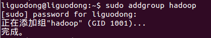
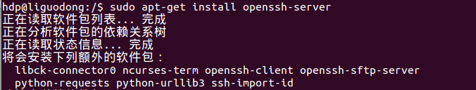
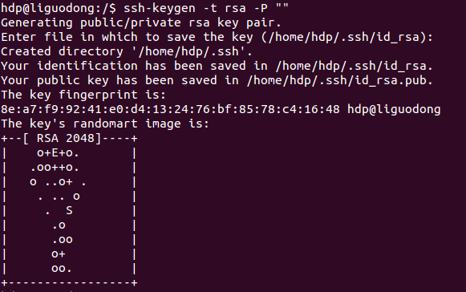
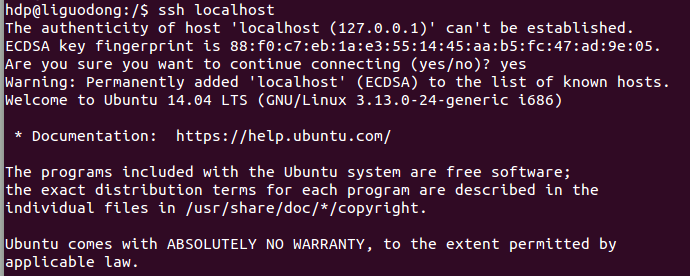
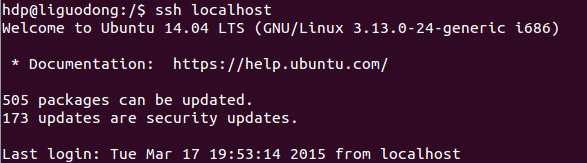

# Ubuntu 14.04安装Hadoop2.5.2(单机模式)

## 一、Hadoop的运行模式

### 单机模式（standalone）

单机模式是Hadoop的默认模式。当首次解压Hadoop的源码包时，Hadoop无法了解硬件安装环境，便保守地选择了最小配置。在这种默认模式下所有3个XML文件均为空。当配置文件为空时，Hadoop会完全运行在本地。因为不需要与其他节点交互，单机模式就不使用HDFS，也不加载任何Hadoop的守护进程。该模式主要用于开发调试MapReduce程序的应用逻辑。

### 伪分布模式（Pseudo-Distributed Mode）

伪分布模式在"单节点集群"上运行Hadoop，其中所有的守护进程都运行在同一台机器上。该模式在单机模式之上增加了代码调试功能，允许你检查内存使用情况，HDFS输入输出，以及其他的守护进程交互。

### 全分布模式（Fully Distributed Mode）

Hadoop守护进程运行在一个集群上。

## 二、创建hadoop组和hadoop用户

增加hadoop用户组，同时在该组里增加hadoop用户，后续在涉及到hadoop操作时，我们使用该用户。

### 1、创建hadoop用户组

sudo addgroup hadoop 
 
groupdel users 删除组users

### 2、创建hadoop用户

sudo adduser -ingroup hadoop hdp 
 
回车后会提示输入新的UNIX密码，这是新建用户hdp的密码，输入回车即可。如果不输入密码，回车后会重新提示输入密码，即密码不能为空。最后确认信息是否正确，如果没问题，输入 Y，回车即可。

### 3、为hadoop用户添加权限

输入：sudo gedit /etc/sudoers ，回车， 打开sudoers文件，给hadoop用户赋予和root用户同样的权限。 

## 三、用新增加的hdp用户登录Ubuntu系统

命令行输入 su hpd 并输入密码。 
或者 
直接切换图形操作系统。

## 四、安装SSH

sudo apt-get install openssh-server 
 
安装完成后，启动服务：sudo /etc/init.d/ssh start 
并查看服务是否正确启动：ps -e | grep ssh 
作为一个安全通信协议，使用时需要密码，因此我们要设置成免密码登录，生成私钥和公钥： 
ssh-keygen -t rsa -P "" 
 
第一次操作时会提示输入密码，按Enter直接过，这时会在～/home/{username}/.ssh下生成两个文件：id_rsa和id_rsa.pub，前者为私钥，后者为公钥。 
现在将公钥追加到authorized_keys中（authorized_keys用于保存所有允许以当前用户身份登录到ssh客户端的用户） 
cat ~/.ssh/id_rsa.pub >> ~/.ssh/authorized_keys 
现在可以登入ssh确认以后登录时不用输入密码: 
ssh localhost 
 登出：exit 
第二次登录： 
 登出：exit 
