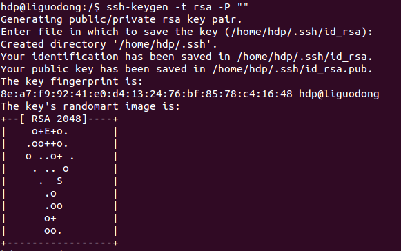
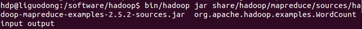

# Ubuntu安装Hadoop2.5.2(单机模式)

系统 Ubuntu 14.04

## 一、Hadoop的运行模式

### 单机模式 standalone

单机模式是Hadoop的默认模式。当首次解压Hadoop的源码包时，Hadoop无法了解硬件安装环境，便保守地选择了最小配置。在这种默认模式下所有3个XML文件均为空。当配置文件为空时，Hadoop会完全运行在本地。因为不需要与其他节点交互，单机模式就不使用HDFS，也不加载任何Hadoop的守护进程。该模式主要用于开发调试MapReduce程序的应用逻辑。

### 伪分布模式 Pseudo-Distributed Mode

伪分布模式在"单节点集群"上运行Hadoop，其中所有的守护进程都运行在同一台机器上。该模式在单机模式之上增加了代码调试功能，允许你检查内存使用情况，HDFS输入输出，以及其他的守护进程交互。

### 全分布模式 Fully Distributed Mode

Hadoop守护进程运行在一个集群上。

## 二、创建hadoop组和hadoop用户

增加hadoop用户组，同时在该组里增加hadoop用户，后续在涉及到hadoop操作时，我们使用该用户。

### 1、创建hadoop用户组

sudo addgroup hadoop<br>
<br>
groupdel users 删除组users

### 2、创建hadoop用户

sudo adduser -ingroup hadoop hdp<br>
<br>
回车后会提示输入新的UNIX密码，这是新建用户hdp的密码，输入回车即可。如果不输入密码，回车后会重新提示输入密码，即密码不能为空。最后确认信息是否正确，如果没问题，输入 Y，回车即可。

### 3、为hadoop用户添加权限

输入：sudo gedit /etc/sudoers ，回车， 打开sudoers文件，给hadoop用户赋予和root用户同样的权限。<br>


## 三、用新增加的hdp用户登录系统

命令行输入 su hpd 并输入密码。<br>
或者<br>
直接切换图形操作系统。

## 四、安装SSH

sudo apt-get install openssh-server<br>
<br>
安装完成后，启动服务：sudo /etc/init.d/ssh start<br>
并查看服务是否正确启动：ps -e | grep ssh<br>
作为一个安全通信协议，使用时需要密码，因此我们要设置成免密码登录，生成私钥和公钥：<br>
ssh-keygen -t rsa -P ""<br>
<br>
第一次操作时会提示输入密码，按Enter直接过，这时会在～/home/{username}/.ssh下生成两个文件：id_rsa和id_rsa.pub，前者为私钥，后者为公钥。<br>
现在将公钥追加到authorized_keys中（authorized_keys用于保存所有允许以当前用户身份登录到ssh客户端的用户）<br>
cat ~/.ssh/id_rsa.pub >> ~/.ssh/authorized_keys<br>
现在可以登入ssh确认以后登录时不用输入密码:<br>
ssh localhost<br>
<br>
登出：exit<br>
第二次登录：<br>
<br>
登出：exit<br>

## 五、安装Java环境

安装jdk：sudo apt-get install openjdk-7-jdk<br>
<br>
查看安装结果，输入命令：java -version，结果如下表示安装成功。<br>


## 六、安装hadoop2.5.2

### 1、下载

官网下载<http://mirror.bit.edu.cn/apache/hadoop/common/><br>
<br>
下载hadoop-2.5.2-src.tar.gz 并放到你希望的目录中， 我是放到/software/中。<br>


### 2、安装

解压sudo tar xzf hadoop-2.5.2.tar.gz<br>
<br>
修改文件夹名，并且赋予用户对该文件夹的读写权限。<br>
sudo mv hadoop-2.5.2 hadoop<br>
sudo chmod 774 hadoop<br>


### 3、配置.bashrc文件

配置.bashrc文件前需要知道Java的安装路径，用来设置JAVA_HOME环境变量，可以使用下面命令行查看安装路径：<br>
update-alternatives --config java<br>
执行后，完整路径为：<br>
/usr/lib/jvm/java-7-openjdk-i386/jre/bin/java<br>
<br>
我们只取前面的部分/usr/lib/jvm/java-7-openjdk-i386<br>
配置.bashrc文件<br>
sudo gedit ~/.bashrc<br>
该命令会打开该文件的编辑窗口，在文件末尾追加下面内容，然后保存，关闭编辑窗口。

```bash
#Hadoop VARIABLES START
export JAVA_HOME=/usr/lib/jvm/java-7-openjdk-i386
export HADOOP_INSTALL=/software/hadoop
export PATH=$PATH:$HADOOP_INSTALL/bin
export PATH=$PATH:$HADOOP_INSTALL/sbin
export HADOOP_MAPRED_HOME=$HADOOP_INSTALL
export HADOOP_COMMON_HOME=$HADOOP_INSTALL
export HADOOP_HDFS_HOME=$HADOOP_INSTALL
export YARN_HOME=$HADOOP_INSTALL
export HADOOP_COMMON_LIB_NATIVE_DIR=$HADOOP_INSTALL/lib/native
export HADOOP_OPTS="-Djava.library.path=$HADOOP_INSTALL/lib"
#HADOOP VARIABLES END
```

<br>
使添加的环境变量生效：source ~/.bashrc

### 4、编辑hadoop-env.sh

/usr/local/hadoop/etc/hadoop/hadoop-env.sh<br>
执行下面命令，打开该文件的编辑窗口<br>
sudo gedit /software/hadoop/etc/hadoop/hadoop-env.sh<br>
找到JAVA_HOME变量，修改此变量如下:<br>
export JAVA_HOME=/usr/lib/jvm/java-7-openjdk-i386<br>
<br>
单机模式安装完成。<br>

## 七、WordCount测试

下面通过执行hadoop自带实例WordCount验证是否安装成功。<br>
/software/hadoop路径下创建input文件夹<br>
mkdir input<br>
拷贝README.txt到input<br>
cp README.txt input<br>
**执行WordCount**<br>

```bash
bin/hadoop jar share/hadoop/mapreduce/sources/hadoop-mapreduce-examples-2.5.2-sources.jar org.apache.hadoop.examples.WordCount input output
```

<br>
执行结果：<br>
<br>
执行 cat output/*，查看字符统计结果。<br>

