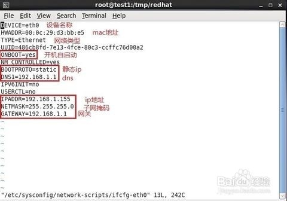
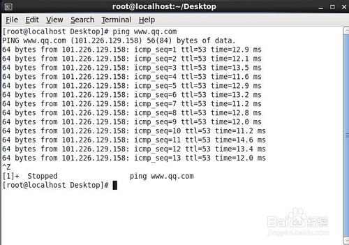

# 修改ip

## 编辑ip

vi /etc/sysconfig/network-scripts/ifcfg-eth0<br>


## 重启网络服务

service network restart或/etc/init.d/network restart<br>
然后ping网关，ping外网进行测试。都能ping通表示网络正常<br>


```
详细摘要：  
---修改ip地址---  
即时生效:  
# ifconfig eth0 192.168.1.155 netmask 255.255.255.0
重启生效:  
修改vi /etc/sysconfig/network-scripts/ifcfg-eth0
---修改default gateway---
即时生效:
# route add default gw 192.168.1.1
重启生效:
修改vi /etc/sysconfig/network-scripts/ifcfg-eth0
---修改dns---
修改vi /etc/resolv.conf
修改后即时生效，重启同样有效
---修改host name---
即时生效:
# hostname test1
重启生效:
修改vi /etc/sysconfig/network
```
