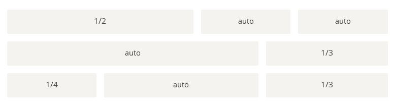

# 语法篇
网页布局（layout）是CSS的一个重点应用。


布局的传统解决方案，基于<u>盒状模型</u>，依赖 <u>display属性</u> + <u>position</u>属性 + <u>float</u>属性。它对于那些特殊布局非常不方便，比如，垂直居中就不容易实现。

## 一、Flex布局是什么？
Flex是Flexible Box的缩写，意为"弹性布局"，用来为盒状模型提供最大的灵活性。

任何一个容器都可以指定为Flex布局。
```css
.box{
  display: flex;
}
```
行内元素也可以使用Flex布局。
```css
.box{
  display: inline-flex;
}
```
Webkit内核的浏览器，必须加上-webkit前缀。
```css
.box{
  display: -webkit-flex; /* Safari */
  display: flex;
}
```
注意，设为Flex布局以后，子元素的float、clear和vertical-align属性将失效。
## 二、基本概念
采用Flex布局的元素，称为Flex容器（flex container），简称"容器"。它的所有子元素自动成为容器成员，称为Flex项目（flex item），简称"项目"。


容器默认存在两根轴：水平的主轴（main axis）和垂直的交叉轴（cross axis）。主轴的开始位置（与边框的交叉点）叫做main start，结束位置叫做main end；交叉轴的开始位置叫做cross start，结束位置叫做cross end。

项目默认沿主轴排列。单个项目占据的主轴空间叫做main size，占据的交叉轴空间叫做cross size。
## 三、容器的属性
以下6个属性设置在容器上：
- flex-direction
- flex-wrap
- flex-flow
- justify-content
- align-items
- align-content
### 3.1 flex-direction属性
flex-direction属性决定主轴的方向（即项目的排列方向）。
```css
.box {
  flex-direction: row | row-reverse | column | column-reverse;
}
```


它可能有4个值：
- row（默认值）：主轴为水平方向，起点在左端。
- row-reverse：主轴为水平方向，起点在右端。
- column：主轴为垂直方向，起点在上沿。
- column-reverse：主轴为垂直方向，起点在下沿。
### 3.2 flex-wrap属性
默认情况下，项目都排在一条线（又称"轴线"）上。flex-wrap属性定义，如果一条轴线排不下，如何换行。


```css
.box{
  flex-wrap: nowrap | wrap | wrap-reverse;
}
```
它可能取三个值。<br>
（1）nowrap（默认）：不换行。<br>


（2）wrap：换行，第一行在上方。<br>


（3）wrap-reverse：换行，第一行在下方。<br>

### 3.3 flex-flow
flex-flow属性是flex-direction属性和flex-wrap属性的简写形式，默认值为row nowrap。
```css
.box {
  flex-flow: <flex-direction> || <flex-wrap>;
}
```
### 3.4 justify-content属性
justify-content属性定义了项目在主轴上的对齐方式。
```css
.box {
  justify-content: flex-start | flex-end | center | space-between | space-around;
}
```


它可能取5个值，具体对齐方式与轴的方向有关。下面假设主轴为从左到右。

- flex-start（默认值）：左对齐
- flex-end：右对齐
- center： 居中
- space-between：两端对齐，项目之间的间隔都相等。
- space-around：每个项目两侧的间隔相等。所以，项目之间的间隔比项目与边框的间隔大一倍。
### 3.5 align-items属性
align-items属性定义项目在交叉轴上如何对齐。
```css
.box {
  align-items: flex-start | flex-end | center | baseline | stretch;
}
```


它可能取5个值。具体的对齐方式与交叉轴的方向有关，下面假设交叉轴从上到下。

- flex-start：交叉轴的起点对齐。
- flex-end：交叉轴的终点对齐。
- center：交叉轴的中点对齐。
- baseline: 项目的第一行文字的基线对齐。
- stretch（默认值）：如果项目未设置高度或设为auto，将占满整个容器的高度。
### 3.6 align-content属性
align-content属性定义了多根轴线的对齐方式。如果项目只有一根轴线，该属性不起作用。
```css
.box {
  align-content: flex-start | flex-end | center | space-between | space-around | stretch;
}
```


该属性可能取6个值。

- flex-start：与交叉轴的起点对齐。
- flex-end：与交叉轴的终点对齐。
- center：与交叉轴的中点对齐。
- space-between：与交叉轴两端对齐，轴线之间的间隔平均分布。
- space-around：每根轴线两侧的间隔都相等。所以，轴线之间的间隔比轴线与边框的间隔大一倍。
- stretch（默认值）：轴线占满整个交叉轴。

## 四、项目的属性
以下6个属性设置在项目上。
- order
- flex-grow
- flex-shrink
- flex-basis
- flex
- align-self
### 4.1 order属性
order属性定义项目的排列顺序。数值越小，排列越靠前，默认为0。
```css
.item {
  order: <integer>;
}
```

### 4.2 flex-grow属性
flex-grow属性定义项目的放大比例，默认为0，即如果存在剩余空间，也不放大。
```css
.item {
  flex-grow: <number>; /* default 0 */
}
```


如果所有项目的flex-grow属性都为1，则它们将等分剩余空间（如果有的话）。如果一个项目的flex-grow属性为2，其他项目都为1，则前者占据的剩余空间将比其他项多一倍。

### 4.3 flex-shrink属性
flex-shrink属性定义了项目的缩小比例，默认为1，即如果空间不足，该项目将缩小。
```css
.item {
  flex-shrink: <number>; /* default 1 */
}
```


如果所有项目的flex-shrink属性都为1，当空间不足时，都将等比例缩小。如果一个项目的flex-shrink属性为0，其他项目都为1，则空间不足时，前者不缩小。

负值对该属性无效。
### 4.4 flex-basis属性
flex-basis属性定义了在分配多余空间之前，项目占据的主轴空间（main size）。浏览器根据这个属性，计算主轴是否有多余空间。它的默认值为auto，即项目的本来大小。
```css
.item {
  flex-basis: <length> | auto; /* default auto */
}
```
它可以设为跟width或height属性一样的值（比如350px），则项目将占据固定空间。
### 4.5 flex属性
flex属性是flex-grow, flex-shrink 和 flex-basis的简写，默认值为0 1 auto。后两个属性可选。
```css
.item {
  flex: none | [ <'flex-grow'> <'flex-shrink'>? || <'flex-basis'> ]
}
```
该属性有两个快捷值：auto (1 1 auto) 和 none (0 0 auto)。

建议优先使用这个属性，而不是单独写三个分离的属性，因为浏览器会推算相关值。
 
### 4.6 align-self属性
align-self属性允许单个项目有与其他项目不一样的对齐方式，可覆盖align-items属性。默认值为auto，表示继承父元素的align-items属性，如果没有父元素，则等同于stretch。
```css
.item {
  align-self: auto | flex-start | flex-end | center | baseline | stretch;
}
```


该属性可能取6个值，除了auto，其他都与align-items属性完全一致。

# 实例篇
你会看到，不管是什么布局，Flex往往都可以几行命令搞定。


我只列出代码，详细的语法解释请查阅《Flex布局教程：语法篇》。我的主要参考资料是Landon Schropp的文章和Solved by Flexbox。

## 一、骰子的布局
骰子的一面，最多可以放置9个点。


下面，就来看看Flex如何实现，从1个点到9个点的布局。你可以到codepen查看Demo。


如果不加说明，本节的HTML模板一律如下。
```html
<div class="box">
  <span class="item"></span>
</div>
```
上面代码中，div元素（代表骰子的一个面）是Flex容器，span元素（代表一个点）是Flex项目。如果有多个项目，就要添加多个span元素，以此类推。

### 1.1 单项目
首先，只有左上角1个点的情况。Flex布局默认就是首行左对齐，所以一行代码就够了。


```css
.box {
  display: flex;
}
```
设置项目的对齐方式，就能实现居中对齐和右对齐。


```css
.box {
  display: flex;
  justify-content: center;
}
```

```css
.box {
  display: flex;
  justify-content: flex-end;
}
```
设置交叉轴对齐方式，可以垂直移动主轴。


```css
.box {
  display: flex;
  align-items: center;
}
```

```css
.box {
  display: flex;
  justify-content: center;
  align-items: center;
}
```

```css
.box {
  display: flex;
  justify-content: center;
  align-items: flex-end;
}
```

```css
.box {
  display: flex;
  justify-content: flex-end;
  align-items: flex-end;
}
```
### 1.2 双项目

```css
.box {
  display: flex;
  justify-content: space-between;
}
```

```css
.box {
  display: flex;
  flex-direction: column;
  justify-content: space-between;
}
```

```css
.box {
  display: flex;
  flex-direction: column;
  justify-content: space-between;
  align-items: center;
}
```

```css
.box {
  display: flex;
  flex-direction: column;
  justify-content: space-between;
  align-items: flex-end;
}
```

```css
.box {
  display: flex;
}

.item:nth-child(2) {
  align-self: center;
}
```

```css
.box {
  display: flex;
  justify-content: space-between;
}

.item:nth-child(2) {
  align-self: flex-end;
}
```
### 1.3 三项目

```css
.box {
  display: flex;
}

.item:nth-child(2) {
  align-self: center;
}

.item:nth-child(3) {
  align-self: flex-end;
}
```
### 1.4 四项目

```css
.box {
  display: flex;
  flex-wrap: wrap;
  justify-content: flex-end;
  align-content: space-between;
}
```

```html
<div class="box">
  <div class="column">
    <span class="item"></span>
    <span class="item"></span>
  </div>
  <div class="column">
    <span class="item"></span>
    <span class="item"></span>
  </div>
</div>
```
```css
.box {
  display: flex;
  flex-wrap: wrap;
  align-content: space-between;
}

.column {
  flex-basis: 100%;
  display: flex;
  justify-content: space-between;
}
```
### 1.5 六项目

```css
.box {
  display: flex;
  flex-wrap: wrap;
  align-content: space-between;
}
```

```css
.box {
  display: flex;
  flex-direction: column;
  flex-wrap: wrap;
  align-content: space-between;
}
```

```html
<div class="box">
  <div class="row">
    <span class="item"></span>
    <span class="item"></span>
    <span class="item"></span>
  </div>
  <div class="row">
    <span class="item"></span>
  </div>
  <div class="row">
     <span class="item"></span>
     <span class="item"></span>
  </div>
</div>
```
```css
.box {
  display: flex;
  flex-wrap: wrap;
}

.row{
  flex-basis: 100%;
  display:flex;
}

.row:nth-child(2){
  justify-content: center;
}

.row:nth-child(3){
  justify-content: space-between;
}
```
### 1.6 九项目

```css
.box {
  display: flex;
  flex-wrap: wrap;
}
```
## 二、网格布局
### 2.1 基本网格布局
最简单的网格布局，就是平均分布。在容器里面平均分配空间，跟上面的骰子布局很像，但是需要设置项目的自动缩放。


```html
<div class="Grid">
  <div class="Grid-cell">...</div>
  <div class="Grid-cell">...</div>
  <div class="Grid-cell">...</div>
</div>
```
```css
.Grid {
  display: flex;
}

.Grid-cell {
  flex: 1;
}
```
### 2.2 百分比布局
某个网格的宽度为固定的百分比，其余网格平均分配剩余的空间。



```html
<div class="Grid">
  <div class="Grid-cell u-1of4">...</div>
  <div class="Grid-cell">...</div>
  <div class="Grid-cell u-1of3">...</div>
</div>
```
```css
.Grid {
  display: flex;
}

.Grid-cell {
  flex: 1;
}

.Grid-cell.u-full {
  flex: 0 0 100%;
}

.Grid-cell.u-1of2 {
  flex: 0 0 50%;
}

.Grid-cell.u-1of3 {
  flex: 0 0 33.3333%;
}

.Grid-cell.u-1of4 {
  flex: 0 0 25%;
}
```

## 三、圣杯布局
圣杯布局（Holy Grail Layout）指的是一种最常见的网站布局。页面从上到下，分成三个部分：头部（header），躯干（body），尾部（footer）。其中躯干又水平分成三栏，从左到右为：导航、主栏、副栏。


```html
<body class="HolyGrail">
  <header>...</header>
  <div class="HolyGrail-body">
    <main class="HolyGrail-content">...</main>
    <nav class="HolyGrail-nav">...</nav>
    <aside class="HolyGrail-ads">...</aside>
  </div>
  <footer>...</footer>
</body>
```
```css
.HolyGrail {
  display: flex;
  min-height: 100vh;
  flex-direction: column;
}

header,
footer {
  flex: 1;
}

.HolyGrail-body {
  display: flex;
  flex: 1;
}

.HolyGrail-content {
  flex: 1;
}

.HolyGrail-nav, .HolyGrail-ads {
  /* 两个边栏的宽度设为12em */
  flex: 0 0 12em;
}

.HolyGrail-nav {
  /* 导航放到最左边 */
  order: -1;
}
```
如果是小屏幕，躯干的三栏自动变为垂直叠加。
```css
@media (max-width: 768px) {
  .HolyGrail-body {
    flex-direction: column;
    flex: 1;
  }
  .HolyGrail-nav,
  .HolyGrail-ads,
  .HolyGrail-content {
    flex: auto;
  }
}
```
## 四、输入框的布局
我们常常需要在输入框的前方添加提示，后方添加按钮。


```html
<div class="InputAddOn">
  <span class="InputAddOn-item">...</span>
  <input class="InputAddOn-field">
  <button class="InputAddOn-item">...</button>
</div>
```
```css
.InputAddOn {
  display: flex;
}

.InputAddOn-field {
  flex: 1;
}
```
## 五、悬挂式布局
有时，主栏的左侧或右侧，需要添加一个图片栏。


```html
<div class="Media">
  
  <p class="Media-body">...</p>
</div>
```
```css
.Media {
  display: flex;
  align-items: flex-start;
}

.Media-figure {
  margin-right: 1em;
}

.Media-body {
  flex: 1;
}
```
## 六、固定的底栏
有时，页面内容太少，无法占满一屏的高度，底栏就会抬高到页面的中间。这时可以采用Flex布局，让底栏总是出现在页面的底部。


```html
<body class="Site">
  <header>...</header>
  <main class="Site-content">...</main>
  <footer>...</footer>
</body>
```

```css
.Site {
  display: flex;
  min-height: 100vh;
  flex-direction: column;
}

.Site-content {
  flex: 1;
}
```
## 七，流式布局
每行的项目数固定，会自动分行。


```css
.parent {
  width: 200px;
  height: 150px;
  background-color: black;
  display: flex;
  flex-flow: row wrap;
  align-content: flex-start;
}

.child {
  box-sizing: border-box;
  background-color: white;
  flex: 0 0 25%;
  height: 50px;
  border: 1px solid red;
}
```


